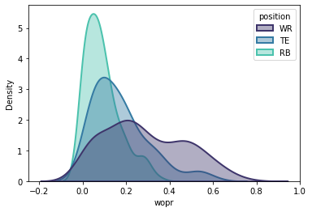
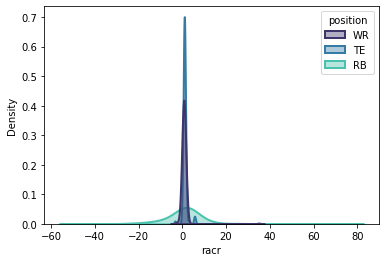
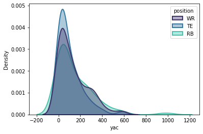
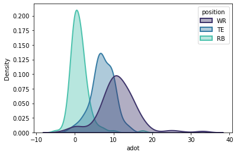
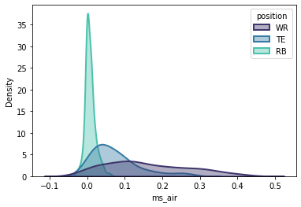

# Exploring Air Yards

Creating density plots of various air-yards-based statistics such as WOPR, RACR, YAC, and aDOT for WRs, TEs, and RBs in fantasy football.   

Inspired by the image below [from here](https://fantasyfootballanalytics.net/2013/04/win-your-snake-draft-calculating-value.html).
   

## Plots Created

## Related Resources
* [Data](https://www.ftnfantasy.com/air-yards)
* [Air Yards Explanation](https://noextrapoints.com/air-yards-and-other-metrics)
* [Intro to KDEs](https://towardsdatascience.com/histograms-and-density-plots-in-python-f6bda88f5ac0)
* Seaborn [kdeplot](https://seaborn.pydata.org/generated/seaborn.kdeplot.html#seaborn.kdeplot) and [color guide](https://seaborn.pydata.org/tutorial/color_palettes.html)